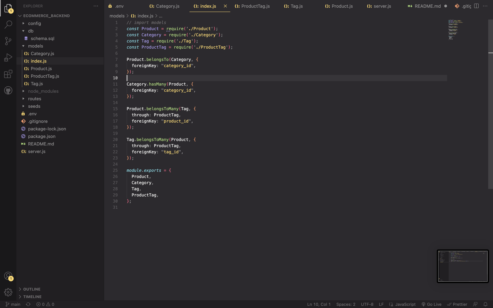
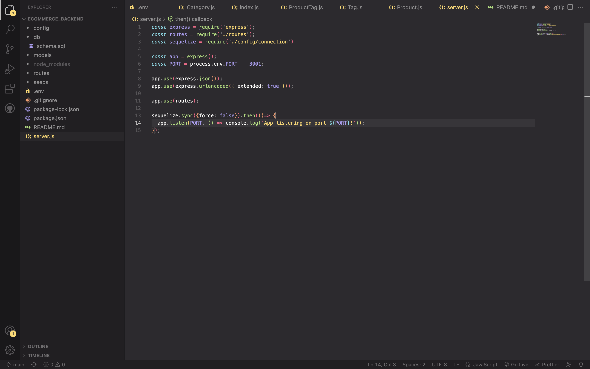

# E-commerce Back End Starter Code

# Walkthrough of Ecommerce

https://drive.google.com/file/d/1cO1TFtc4m3L50RYIq1AItTdKkibXSP3M/view

# Walkthrough of Backend Insomia

## Screenshot

## Table of Contents

- [Description](#description)
- [Installation](#installation)
- [Usage](#usage)
- [Contributors](#contributors)
- [Testing](#testing)
- [Additional Info](#additional-info)
- [Questions and Contribution instructions](#questions-and-contribution-instructions)

## Description:

This project was nade to develop a back-end for an e-commerce app using express, mysql2 and sequelize.

## Installation:

Please clone repo and then rename the '.env.EXAMPLE' file to '.env' and fill in required fields. Then use 'node . ' to run application.

## Usage:

Please see insomania video for routes used.

## Contributors:

Sakariya Adam

## Testing:

n/a

## Additional Info:

- Github: [Sakariya95](https://github.com/Sakariya95)

## Questions and Contribution instructions:

Please contact this email address with any questions about the project or if you'd like to contribute!

- Email: niyyex@live.co.uk

## Licensing:

